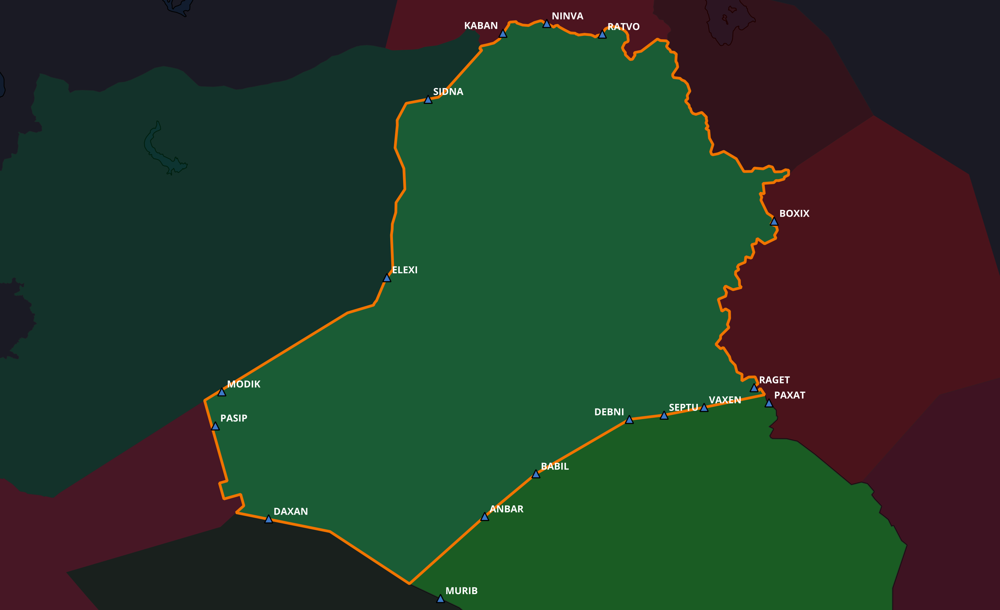

## Callsign
Baghdad Control

## Login
TBC

## Frequency
132.875 MHz

## Overview

Baghdad North Lower provides ATS services within the northern portion of the Baghdad FIR.

## Adjacent Sectors

- BNU
- BS
- Ankara FIR
- Tehran FIR

## Airspace Classification

### Class A
Above FL235

### Class E
Published ATS routes

### Class G
Outside controlled airspace  

## Major ATS Routes

### Northbound

- UM860
- UM688

### Southbound

- UL602

### Eastbound

- M703