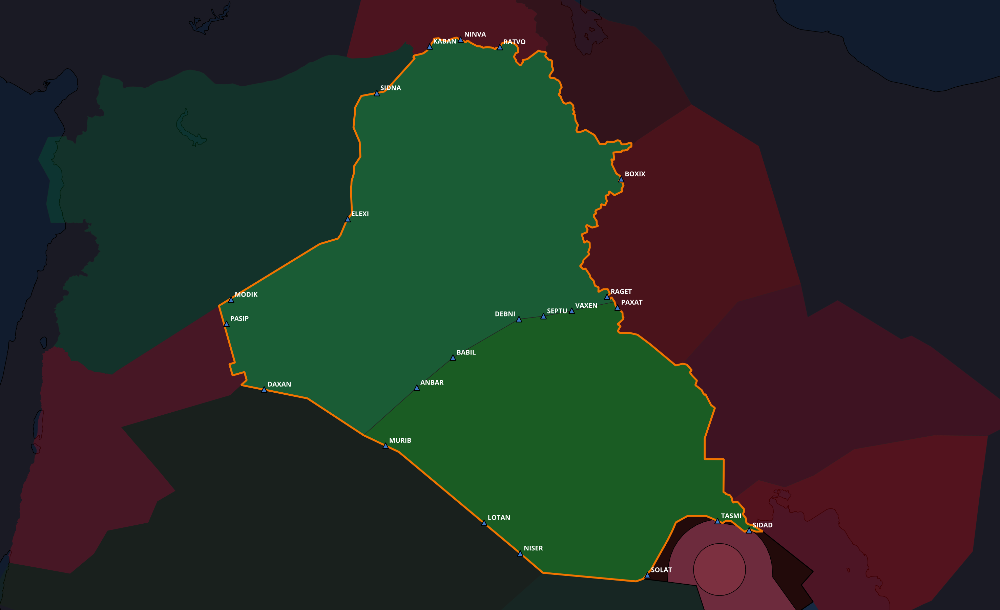

Welcome to the Baghdad Control section. This section provides information on the sector splits within the Baghdad FIR.

# Enroute Airspace Structure

The following positions, for Baghdad ACC, are defined in the table below.

| ID  | Logon Callsign        | Frequency | Sector | Levels (FL)  |
|-----|-----------------------| --------- | ------ |--------------|
| B   | ORBB_CTR              | 124.400   | Bandbox | 235 - 460    |
| BN  | [ORBB_N_CTR](BN.md)   | 132.875   | North Low | 235 - 345    |
| BS  | [ORBB_S_CTR](BS.md)   | 128.700   | South Low | 235 - 345    |
| BNU | [ORBB_NU_CTR](BNU.md) | 125.900   | North High | 345 - 460    |
| BSU | [ORBB_SU_CTR](BSU.md) | 127.100   | South High | 345 - 460    |

---

# Supplementary Services

Prior to being provided with radar service, an ATCO unit will establish identification of the aircraft concerned. A pilot will be informed whenever radar identification is established or lost.

> Controller: "IAW123, radar identified/contact"

> Controller: "Radar identification/contact lost"

!!! info "Radar Control Service"
    A radar control service will be provided in all controlled airspaces within the Baghdad FIR, and along all airways except from segments of airways in the west of the Baghdad FIR.
    Information regarding this, can be found in the ['Procedural' page](Procedural.md).

