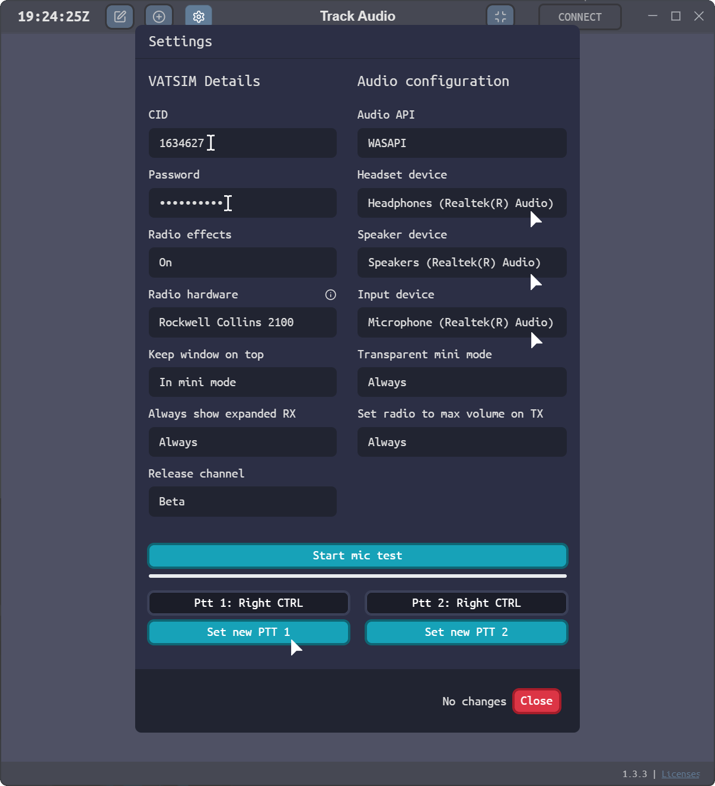

**Download Link:** [TrackAudio version 1.3.3](https://github.com/pierr3/TrackAudio/releases/tag/1.3.3 "Opens in a new tab"){target="_blank"}

## What is TrackAudio?
TrackAudio is a next generation Audio-For-VATSIM ATC Client for macOS, Linux and Windows.

## Setting up Audio for VATSIM

- Input your VATSIM Details
  * Your VATSIM CID
  * Your VATSIM Password
- Audio configuration
  * Select a Headset, Speaker and Input device
- Set a Push-To-Talk (PTT) bind
- Save your changes by pressing 'Close' on the bottom right

### Extra Settings

TrackAudio offers extra options that you can configure. These do not affect your ability to receive and transmit on frequency, but can improve your experience.

## Connecting and Transmitting on Frequency

- Open TrackAudio, if setup correctly and connected to VATSIM you will be able to see a green 'CONNECT' button.

- Once connected, you will see the callsign that you have logged on with at the top. If you have a valid callsign, then the relevant frequencies will populate automatically.
- Click on 'XCA' to receive, transmit and couple all the tranceivers together in one button. For more information, see '[What is XC and XCA?](https://github.com/pierr3/TrackAudio#what-is-xc-and-xca "Opens in new tab"){target="_blank"}'.

## Connecting and Transmitting on Frequency

- Open TrackAudio, if setup correctly and connected to VATSIM you will see a green 'CONNECT' button.
  
- Once connected, you will see the position you have logged on as at the top. If your callsign is correct, then the frequencies will populate automatically.
- Click 'TX' (transmit) to both recieve and transmit on the selected frequency.
- Use your selected PTT button to transmit on the frequency.
  

## Cross-Coupling Frequencies

- To Cross-Couple (XC) a frequency, click on the XCA button of the frequencies you want to cross-couple.
  

- By default, AFV will set you as TX on your primary frequency. If observering, see [below](#observing). 
- Click 'TX' to transmit on the frequency. You will need to use your PTT keybind to transmit; when transmitting the 'TX' button will be orange.

## Adding a new frequency

- To RX, TX or XC a different frequency, click the **+** button, type in the station callsign and then press the ✔ button.

## Cross-coupling a frequency

Cross-coupling allows transmissions, on more than 1 tranceiver to be re-emitted by other transceivers. See '[What is XC and XCA?](https://github.com/pierr3/TrackAudio#what-is-xc-and-xca "Opens in new tab"){target="_blank"} for more.

- To cross-couple a frequency, click on the 'XC' button next to frequencies you wish to cross-couple. You **must click the 'XC' button for all concerned frequencies.**

Click 'RX' to listen in the frequency.

## Observing

When connecting to AFV as an observer, you will be set to RX on your primary frequency (which should be 199.998).
To add a different frequency, click the **+** button, type in the station callsign and then press the ✔ button.
To then listen on the frequency, click on the 'RX' button.

## Extras

Audio for VATSIM also offers a 'mini-mode'. This forces the client to the front of your screen, and minimises the information shown.
To enable this, click on the ↑ button on the top of the client.

Still having issues with TrackAudio? Feel free to ask for help in one of our channels in the Gulf vACC Discord server which can be found in the [VATSIM Community Hub](https://community.vatsim.net/ "Opens in new tab"){target="_blank"}.